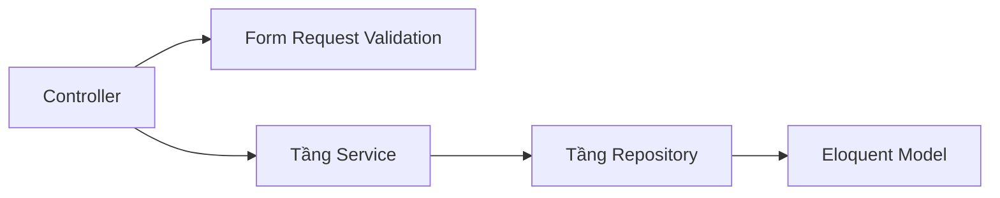

# 04. Phân tích Chuyên sâu Backend (Backend Deep Dive)

## 1. Tổng quan
Backend là một RESTful API được xây dựng trên nền **Laravel 12** và **PHP 8.3**. Nó quản lý toàn bộ dữ liệu lưu trữ, logic nghiệp vụ, ủy quyền truy cập (authorization), và tích hợp bên thứ ba (VD: Google OAuth).

## 2. Kiến trúc Cốt lõi: Mẫu Service-Repository
Thay vì đặt "code mập mạp" (fat logic) trực tiếp vào bên trong Controllers, MindHub sử dụng một kiến trúc phân tầng (layered architecture).

### A. Controllers (`app/Http/Controllers`)
Controllers được thiết kế rất mỏng (thin). Mục đích tồn tại duy nhất của chúng là:
1. Nhận HTTP request.
2. Giao việc xác thực dữ liệu (validation) cho một FormRequest.
3. Gọi một phương thức tương ứng tại tầng Service.
4. Trả về kết quả thông qua một API Resource.

*Quy tắc: Không cho phép viết trực tiếp các câu truy vấn cơ sở dữ liệu (`Model::where()`) bên trong Controllers.*

### B. Form Requests (`app/Http/Requests`)
Kiểm tra tính hợp lệ của dữ liệu đầu vào (Payload validation) và các quy tắc cấp quyền cơ bản được xử lý ở đây trước khi chạm đến logic trong Controller. Chúng được tổ chức vào các thư mục theo module như `Requests/Admin/`, `Requests/Auth/`, v.v.

### C. Services (`app/Services`)
Đây là nơi chứa Logic Nghiệp vụ (Business logic) thực sự. 
- Ví dụ: `PaymentService` tính toán mức giảm giá của coupon, tạo đối tượng `Order`, và giao tiếp với cổng thanh toán VNPay. 
- Các Service có thể điều phối nhiều Repository khác nhau nếu cần.

### D. Repositories (`app/Repositories`)
Tầng này xử lý TẤT CẢ các tương tác trực tiếp với database. Bằng cách trừu tượng hóa các câu lệnh truy vấn Eloquent vào một Repository, tầng Service không cần quan tâm đến cách thức dữ liệu được lấy lên như thế nào.
- Ví dụ: `CourseRepository->findActiveCourses()`.

## 3. Xác thực & Ủy quyền (Authentication & Authorization)
- **Laravel Sanctum**: Dùng để cấp phát API tokens. Ứng dụng SPA (Frontend) lưu trữ token này và gửi nó dưới dạng Bearer token trong header `Authorization`.
- **Middleware**: `AuthenticateSessionToken` và `RoleMiddleware` đảm bảo các endpoint được bảo vệ theo vai trò người dùng (`student`, `instructor`, `admin`).
- **Policies (`app/Policies`)**: Ủy quyền chi tiết theo từng dòng (VD: "User cụ thể này có được phép chỉnh sửa khóa học cụ thể này không?").

## 4. Các Hệ thống Con (Sub-Systems)
- **Catalog & Course**: Xử lý việc hiển thị công khai khóa học cho khách truy cập, lọc, và phân loại danh mục.
- **Learning (Học tập)**: Quản lý quyền truy cập video (`SignedAssetUrlService`), tiến trình khóa học (`CourseProgressTest`), và làm bài thi (Quiz).
- **Payment & Marketing**: Điều phối mã giảm giá (coupons), tích hợp VNPay, và chia sẻ doanh thu.
- **Reporting (Báo cáo)**: Phân tích số liệu nâng cao cho các Dashboard của Instructor và Admin (`CourseAnalyticsService`).

---
*Tiếp theo: [05-database-analysis.md](./05-database-analysis.md)*
