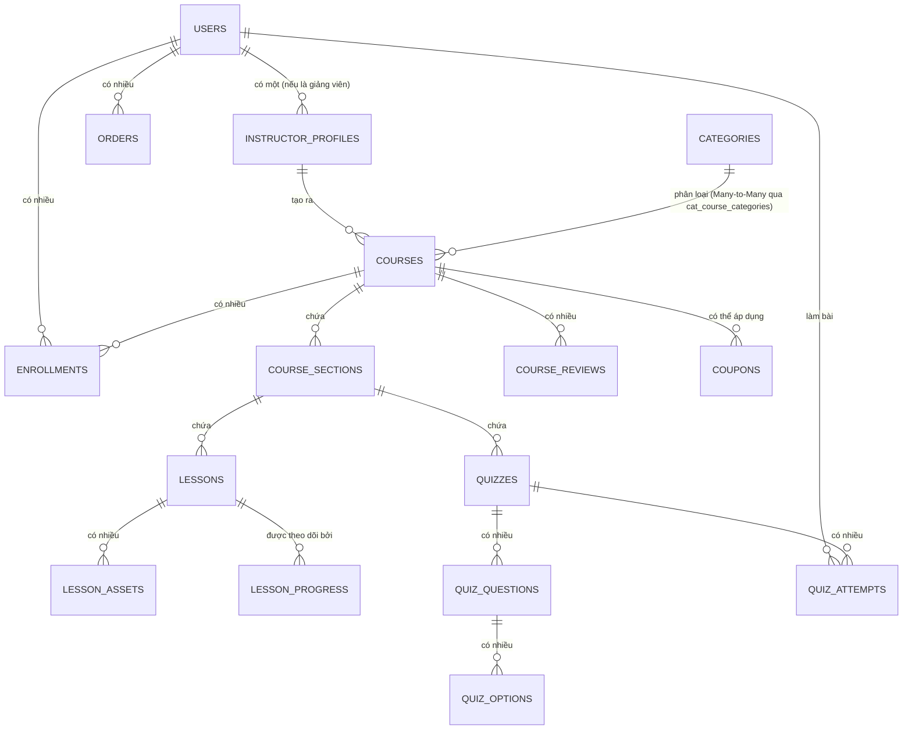

# 05. Phân tích Cơ sở dữ liệu (Database Analysis)

## 1. Tổng quan
Hệ thống sử dụng cơ sở dữ liệu quan hệ (MySQL/MariaDB). Lược đồ (schema) được quản lý hoàn toàn thông qua tính năng Laravel Migrations nằm tại thư mục `database/migrations/`.

## 2. Tóm tắt Sơ đồ Quan hệ Thực thể (ERD)

## 3. Các Bảng và Mối quan hệ Chính

### Định danh & Quyền truy cập
- **`users`**: Bảng xác thực trung tâm. Lưu email, mật khẩu đã hash, và vai trò (`student`, `instructor`, `admin`).
- **`instructor_profiles`**: Quan hệ 1-1 (One-to-One) với bảng `users`. Lưu các dữ liệu riêng của giảng viên (tiểu sử, chuyên môn, thông tin rút tiền).
- **`auth_sessions`**: Theo dõi các phiên đăng nhập đang kích hoạt và quản lý giới hạn thiết bị.

### Danh mục Nội dung
- **`categories`**: Chủ đề (có phân cấp hoặc cấu trúc phẳng).
- **`courses`**: Sản phẩm chính (Khóa học). Thuộc về một giảng viên. Có các trạng thái (`draft`, `pending_review`, `published`).
- **`course_categories`**: Bảng trung gian (Pivot table) cho quan hệ Nhiều-Nhiều (Many-to-Many) giữa khóa học và danh mục.

### Giáo trình (Curriculum)
- **`course_sections`**: Các chương hoặc học phần trong khóa học.
- **`lessons`**: Bài giảng video hoặc văn bản trong một chương.
- **`lesson_assets`**: Các tệp đính kèm có thể tải xuống cho bài học.
- **`quizzes`**: Bài trắc nghiệm kiểm tra trong một chương.
- **`quiz_questions` & `quiz_options`**: Định nghĩa cấu trúc câu hỏi của một bài quiz.

### Thương mại & Tiến trình
- **`orders`**: Ghi nhận các giao dịch thanh toán (hóa đơn), chứa mục đích thanh toán và trạng thái.
- **`enrollments`**: Được tạo khi một đơn hàng hoàn tất. Cấp quyền truy cập vào khóa học cho người dùng.
- **`revenues`**: Theo dõi doanh thu, tỷ lệ ăn chia giữa nền tảng và giảng viên khi đơn hàng hoàn tất.
- **`lesson_progress` / `video_progress`**: Theo dõi tiến độ hoàn thành bài học của người học.

## 4. Ràng buộc Đáng chú ý (Constraints)
- **Khóa ngoại (Foreign Keys)**: Laravel thực thi tính toàn vẹn tham chiếu nghiêm ngặt. Khi xóa một khóa học, hệ thống thường sẽ xóa theo dạng dòng thác (cascade) các phần (sections) và bài học (lessons) của nó (hoặc sử dụng soft deletes tùy thuộc vào migration).
- **Chỉ mục (Indexes)**: Các Migration đều có đánh index (chỉ mục) vào những cột thường xuyên được truy vấn (VD: `role`, `status`, `user_id`, `course_id`) để đảm bảo hiệu suất tốt khi dữ liệu lớn.

---
*Tiếp theo: [06-api-analysis.md](./06-api-analysis.md)*
