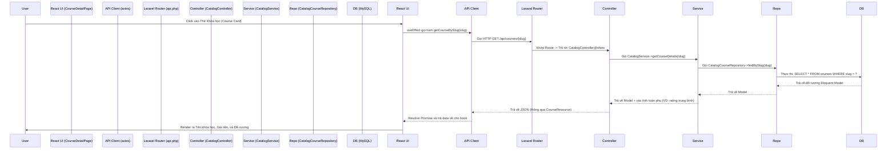

# 08. Luồng Xử lý Request End-to-End (Request Flow)

## Ví dụ: Lấy dữ liệu Chi tiết Khóa học

Đây là vết theo dõi chính xác đường đi của luồng dữ liệu khi người dùng click vào một thẻ khóa học (Course Card) để xem chi tiết.

## Phân tích Chi tiết Từng bước

1. **Trình duyệt (Browser)**: Người dùng điều hướng tới url `/courses/react-for-beginners`.
2. **React (`src/features/courses/CourseDetailPage.tsx`)**: Component được mount lên. Hook `useEffect` sẽ chạy, trích xuất biến `slug` từ tham số URL.
3. **API Client (`src/features/courses/api.ts`)**: Hook gọi hàm `fetchCourse(slug)`. Hàm này sử dụng lớp bọc Axios, lớp bọc này tự động đính kèm `Bearer` token vào Header nếu người dùng đã đăng nhập (cho phép server trả về dữ liệu cá nhân hóa như việc kiểm tra xem người dùng đã sở hữu khóa học này hay chưa).
4. **Laravel Route (`routes/api/catalog.php`)**: Request chạy tới server và chạm vào route: `Route::get('/courses/{slug}', [CatalogController::class, 'show'])`.
5. **Controller (`app/Http/Controllers/CatalogController.php`)**: Controller nhận biến slug từ URL. Nó KHÔNG truy vấn database trực tiếp mà sẽ gọi hàm của `CatalogService`.
6. **Service (`app/Services/Catalog/CatalogService.php`)**: Service điều phối logic. Nó có thể kiểm tra Cache trước, nếu không có Cache, nó sẽ gọi tới Repository.
7. **Repository (`app/Repositories/Catalog/CatalogCourseRepository.php`)**: Thực thi truy vấn bằng Eloquent: `Course::with(['instructor', 'sections.lessons'])->where('slug', $slug)->firstOrFail()`.
8. **Phản hồi (Response)**: Đối tượng Model được truyền ngược trở lại. Controller sẽ bọc Model này trong `new CourseResource($course)` để lọc bỏ đi các trường nhạy cảm và format lại ngày tháng, sau đó trả về chuẩn JSON.
9. **UI Render (Vẽ lại giao diện)**: React state được cập nhật với dữ liệu mới, component tắt vòng xoay loading và hiển thị nội dung khóa học thực tế.

---
*Tiếp theo: [09-current-progress.md](./09-current-progress.md)*
